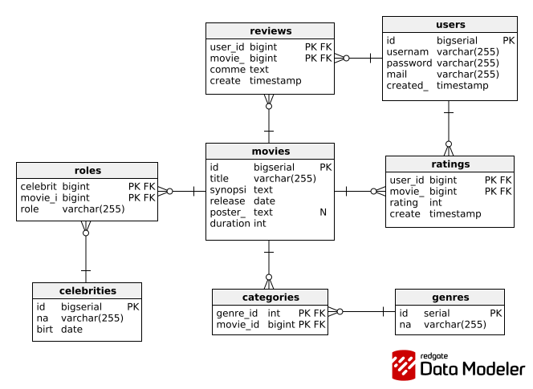

# Web-Page 🍿

Este proyecto es una aplicación web desarrollada como parte de la currícula de la **Universidad Nacional del Centro de la Provincia de Buenos Aires (UNICEN)**. La aplicación se centra en el dominio de la cinematografía, permitiendo a los usuarios interactuar con una base de datos de películas, géneros, actores y más.


---
## Tecnologías Utilizadas

El proyecto está construido sobre un stack de tecnologías moderno, enfocado en la eficiencia, la automatización y las buenas prácticas de desarrollo.

* [Go (Golang)](https://go.dev/)
* [PostgreSQL](https://www.postgresql.org/)
* [Docker](https://www.docker.com/) & [Docker Compose](https://docs.docker.com/compose/)
* [GNU Make](https://www.gnu.org/software/make/)
* [SQL Compiler (sqlc)](https://sqlc.dev/)
* [Atlas](https://atlasgo.io/)
* [Air](https://github.com/cosmtrek/air)

---
## Estructura del Proyecto

El repositorio está organizado siguiendo convenciones estándar para facilitar la mantenibilidad y escalabilidad.

```
.
├── cmd/                        # Punto de entrada de la aplicación (main.go)
│   └── web/
│       └── main.go
├── internal/                   # Código privado del proyecto (no importable por otros)
│   ├── config/                 # Lógica de configuración del entorno
│   ├── docs/                   # Documentación del proyecto: Imágenes y GIFs
│   ├── domain/                 # -- Nivel de Lógica de Negocio  --
│   ├── middleware/             # Middleware del proyecto
│   ├── service/                
│   ├── storage/                # -- Nivel de Datos --
│   │   └── postgres/           
│   │       ├── migrations/     # Archivos de migración generados por Atlas
│   │       ├── queries/        # Consultas SQL para sqlc
│   │       ├── schema/         # Esquemas de la base de datos
│   │       ├── sqlc/           # Archivos generados por sqlc
│   │       └── postgre.go      # Manejo de conexión con base de datos PostgreSQL
│   └── transport/              # Manejo de HTTP, handlers
│       └── views/              # Manejo de plantillas
├── web/                        
│   └── static/                 # Archivos estáticos
│       └── styles/
├── .air.toml                   # Configuración para Air (hot-reload)
├── .dockerignore               # Archivos a ignorar por Docker
├── .gitignore                  # Archivos a ignorar por Git
├── Dockerfile                  # Instrucciones para construir la imagen de la app
├── atlas.hcl                   # Configuración para Atlas (migraciones)
├── docker-compose.yml          # Definición de servicios Docker (app y db)
├── go.mod                      # Dependencias del proyecto Go
├── sqlc.yml                    # Configuración para sqlc
├── .env                        # Variables de entorno
└── Makefile                    # Centro de comandos para automatizar tareas
```

---
## Build

Sigue estos pasos para construir y ejecutar el proyecto en tu entorno local.

### Requisitos Previos

Antes de empezar, asegúrate de tener instaladas las siguientes herramientas en tu sistema.

#### 1. Herramientas del Sistema

* **Git:** Para clonar el repositorio.
* **Docker & Docker Compose:** Para ejecutar la base de datos y la aplicación en contenedores.
* **Go:** El lenguaje de programación (versión 1.21 o superior).
* **Make:** Para ejecutar los comandos automatizados del proyecto.

#### 2. Herramientas de Línea de Comandos de Go

Estas son herramientas de desarrollo que nos ayudan a automatizar tareas. Se instalan fácilmente con `go install`:

* **sqlc** (Generador de código para la base de datos):
```bash
go install github.com/sqlc-dev/sqlc/cmd/sqlc@latest
```
* **Air** (Recarga en caliente para desarrollo local):
```bash
go install github.com/air-verse/air@latest
```
* **Atlas** (Herramienta de migraciones de base de datos):
```bash
go install ariga.io/atlas/cmd/atlas@latest
```
* **Templ** (Herramienta de generación de código a partir de plantillas):
```bash
go install github.com/go-templ/templ/cmd/templ@latest
```
**Nota:** configura el PATH para Go. Si utilizas Go y no tenes agregado su binario al PATH, necesitas exportarlo para que el sistema reconozca los comandos instalados con go install.
```bash
export PATH=$PATH:$HOME/go/bin
```

### Instalación y Ejecución

1.  **Clona el repositorio:**
```bash
git clone https://github.com/Matias914/Web-Page.git
cd Web-Page
```

2.  **Crea tu archivo de entorno:**
    Copia el archivo de ejemplo `.env.example` a un nuevo archivo llamado `.env`. Este archivo es ignorado por Git y contiene tus secretos locales.
```bash
cp .env.example .env
```


3.  **Inicia el entorno de producción:**
    Este único comando utiliza el `Makefile` para orquestar todo: levanta la base de datos y la aplicación en contenedores docker.
```bash
make prod
```

4. **¡Listo!**
   La aplicación estará corriendo y accesible en `http://localhost:8080`.

5. **Opcional:** Para detener el entorno de producción, se utiliza el siguiente comando de make:
```bash
make prod-down
```
---

## Flujo de Trabajo

### Recarga en Caliente
Gracias a **Air**, cualquier cambio que guardes en un archivo `.go` o `.sql` disparará automáticamente la regeneración de código, la recompilación y el reinicio del servidor. Verás los cambios reflejados en segundos.

### Migraciones de Base de Datos
La evolución del esquema de la base de datos se gestiona con **Atlas**. El flujo de trabajo es el siguiente:
1.  **Modifica el esquema:** Realiza cambios en el archivo `internal/storage/postgres/schema/schema.sql`.
2.  **Genera una nueva migración:** Ejecuta `make migrate-diff NAME=nombre_descriptivo_del_cambio`.
3.  **Aplica la migración:** Ejecuta `make migrate-up` para aplicar los cambios a tu base de datos.

## Arquitectura de Base de Datos

Se adjunta un modelo de la base de datos para que se tenga a disposición una referencia visual de la arquitectura.



## Comandos Disponibles

El `Makefile` es el centro de control del proyecto. Ejecuta `make help` para ver una lista completa y actualizada de todos los comandos disponibles.

```bash
$ make help
Uso: make [comando]

Comandos Principales:
  dev           - Inicia DB, aplica migraciones y corre el servidor en modo desarrollo.
  prod          - Construye y levanta toda la aplicación (app y db) en Docker.
  prod-down     - Detiene los contenedores de producción y remueve contenedores huérfanos.
  server        - Corre el servidor con hot-reload (Air).

Comandos de Base de Datos (Docker):
  db-up         - Inicia el contenedor de la base de datos.
  db-down       - Detiene el contenedor de la base de datos.
  db-nuke       - Detiene y elimina los volúmenes de la base de datos.

Comandos de Migraciones (Atlas):
  migrate-diff  - Crea un nuevo archivo de migración (requiere NAME).
  migrate-up    - Aplica todas las migraciones pendientes.
  migrate-set   - Revierte a una migración anterior (requiere VERSION).

Comandos de Desarrollo:
  sqlc-gen      - Genera código Go desde las queries SQL.
  templ-gen     - Genera código desde plantillas Templ.
  build         - Compila el binario de la aplicación.
  run           - Compila y ejecuta el binario.
  tidy          - Ordena y verifica las dependencias de Go.
  clean         - Elimina el directorio de binarios.
  docker-clean  - Limpieza completa del proyecto actual en Docker.
  docker-nuke   - Elimina contenedores y volúmenes de Docker no utilizados.
```

---
## Desarrolladores

* **Ortiz Matias** - *Estudiante*
* **Leon Nicolas** - *Estudiante*

**Universidad Nacional del Centro de la Provincia de Buenos Aires (UNICEN)**
Facultad de Ciencias Exactas - Tandil, Buenos Aires.
Septiembre, 2025.


